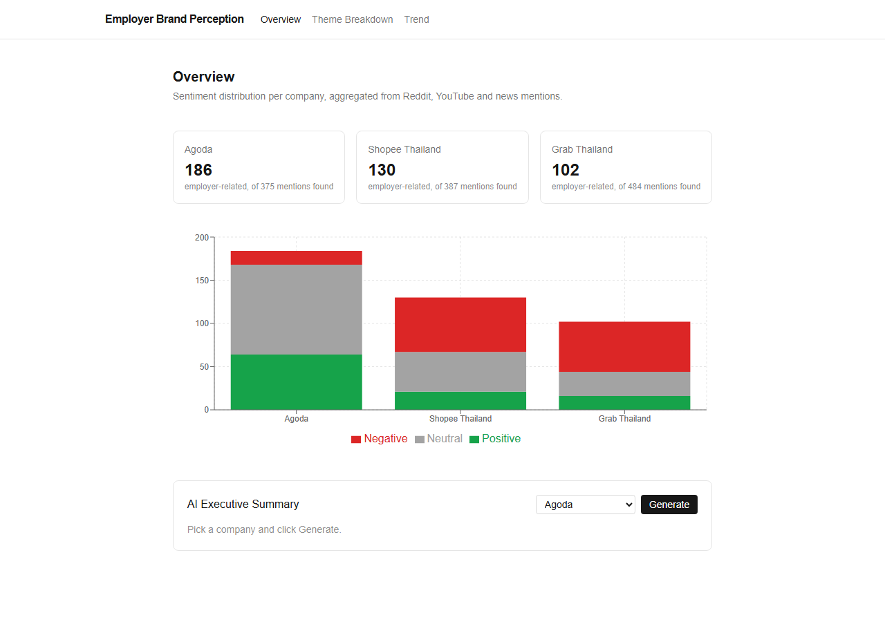

# Employer Brand Perception Analyzer

**[Live demo →](https://employer-brand-perception.vercel.app)**

A social-listening pipeline and dashboard that measures how people talk about companies
*as employers* — not as products or brands, but specifically as places to work. Built around
three companies with very different public profiles: **Agoda**, **Shopee Thailand**, and
**Grab Thailand**.



## What this project demonstrates

This project sits at the intersection of three things I bring to a Martech/data analyst role:
HR domain knowledge, a psychology background, and hands-on data engineering.

The **HR angle** shows up in the theme taxonomy (Compensation & Benefits, Work-Life Balance,
Management & Leadership, Career Growth & Development, Company Culture, Job Security &
Stability) — these are the six things I've seen come up over and over in exit interviews and
candidate conversations when people talk about why they joined, stayed, or left a company.
It's not a generic sentiment-analysis taxonomy; it's built from what actually matters to
employees.

The **psychology angle** is in how the pipeline treats sentiment. Raw social sentiment is not
the same as *employer* sentiment — most public mentions of a company are about its product, app,
or stock, not about working there. Collapsing all of that into one sentiment score would measure
brand perception, not employer perception, and would mislabel a comment like "this app keeps
crashing" as negative employer sentiment when it has nothing to do with employment. So the
classification step first asks Claude to judge whether a comment is even about the company *as
an employer* (pay, hours, management, culture, growth, stability) before scoring sentiment or
theme — treating attitude and relevance as separable questions, not one blended score.

The **data engineering angle** is the pipeline itself: multi-source collection (YouTube, News),
an idempotent merge step keyed by content hash so re-running a collector updates in place instead
of duplicating, a junk filter before anything reaches a paid API call, a classification cache so
aggregation changes don't re-spend API credits, and a chi-square test of independence to check
whether the theme distributions across companies differ by more than noise.

## What it found

- **Agoda** skews positive/neutral, with **Career Growth & Development** as the dominant theme —
  consistent with its large, English-language "life at Agoda" content on YouTube.
- **Shopee Thailand** and **Grab Thailand** skew negative, driven heavily by **Compensation &
  Benefits** — most of their employer-related comments come from gig-economy drivers/riders
  discussing pay and hours, a very different employee population than Agoda's office staff.
- A chi-square test of independence confirms the theme distributions differ significantly across
  the three companies (χ² = 99.07, df = 12, p < 0.001) — the difference isn't noise.

## Pipeline

```
scripts/collect_youtube.py  ─┐
scripts/collect_news.py     ─┼─→ data/raw_comments.json   (deduped by content hash)
scripts/collect_reddit.py   ─┘        │
                                       ▼
                          scripts/analyze.py
                    (Claude: employer_related? + sentiment + theme)
                                       │
                                       ▼
                     data/processed_insights.json  ─→  Next.js dashboard
```

1. **Collect** — search YouTube and NewsAPI for each company, keeping only videos/articles whose
   title actually mentions it (word-boundary matched, not substring — "grab" ≠ "grabbing").
   Junk (emoji-only reactions, bare timestamps) is filtered before it reaches any API.
2. **Classify** — batches of 10 comments go to Claude (`claude-haiku-4-5`) with instructions to
   flag whether each comment is actually about being an employer, then label sentiment, theme,
   and confidence. Results are cached by comment ID so re-running the aggregation step (e.g. to
   change how trends are bucketed) doesn't re-classify comments it already has an answer for.
3. **Aggregate** — sentiment distribution, theme frequency, and a quarterly sentiment trend per
   company, plus a chi-square test comparing theme distributions across companies.
4. **Visualize** — a Next.js dashboard (Overview, Theme Breakdown, Trend) reading the aggregated
   JSON, plus an "AI Executive Summary" panel that calls Claude live to turn the numbers for a
   selected company into a paragraph.

## Tech stack

- **Collection**: Python, `google-api-python-client` (YouTube Data API v3), `requests` (NewsAPI),
  `praw` (Reddit — supported but unused in the live run, see Limitations)
- **Analysis**: Claude (Anthropic API) for classification, `scipy.stats` for the chi-square test
- **Dashboard**: Next.js (App Router) + TypeScript + Tailwind CSS + Recharts
- **Deployment**: GitHub → Vercel, auto-deploy on push to `main`

## Running it locally

```bash
npm install
pip install -r requirements.txt
cp .env.example .env.local   # fill in your API keys
python scripts/collect_all.py
python scripts/analyze.py
npm run dev
```

Get API keys from: [Google Cloud Console](https://console.cloud.google.com) (YouTube Data API
v3), [NewsAPI.org](https://newsapi.org/register), [Anthropic Console](https://console.anthropic.com).
Reddit requires [creating a script app](https://www.reddit.com/prefs/apps) and, as of 2024,
requesting approval under Reddit's Responsible Builder Policy — `collect_reddit.py` skips itself
automatically if `REDDIT_CLIENT_ID`/`REDDIT_CLIENT_SECRET` aren't set.

## Limitations (and why they're here on purpose)

Real social-listening data is messy, and I'd rather document that than hide it:

- **Not every mention is about employment.** Of 1,266 raw comments collected, only 418 (33%)
  were actually about being an employer — the rest were about the product, the app, stock price,
  or general reactions. This is expected and handled (see Pipeline above), not a bug.
- **Sample size varies a lot by company.** Agoda has a much larger English-language "life at the
  company" YouTube presence than Shopee or Grab, so its sample (186) is nearly double the other
  two (130, 102). The original target list (True Digital Group, SCBX) was dropped entirely after
  an initial run found only 7 and 2 employer-related comments respectively — too small to say
  anything meaningful, so I swapped in companies with a genuinely comparable public footprint
  rather than force a conclusion out of n=2.
- **Geographic scope leakage.** Shopee and Grab operate region-wide in Southeast Asia, and
  YouTube comments can't be filtered by commenter location — some Indonesian-market comments on
  Shopee/Grab videos likely made it into the "Thailand" dataset.
- **NewsAPI's free tier** only returns articles from the last ~1 month, so News is a thin,
  recency-biased source compared to YouTube.
- **Trend data spans 2020–2026** (comments on old videos are still being posted today), so it's
  bucketed quarterly rather than monthly, and quarters with fewer than 3 comments are left as
  gaps rather than plotted — a single comment shouldn't swing a trend line to ±1.
- **Reddit is unused in the live data** — its API now requires requesting approval under
  Reddit's Responsible Builder Policy, which wasn't pursued for this project. The collector is
  fully implemented and would slot in the moment that approval exists.
